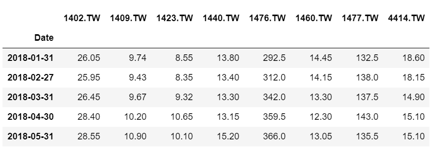
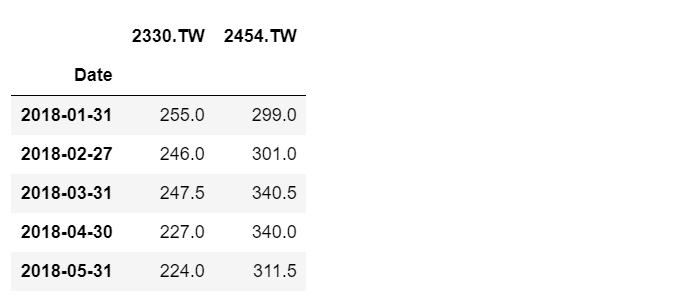
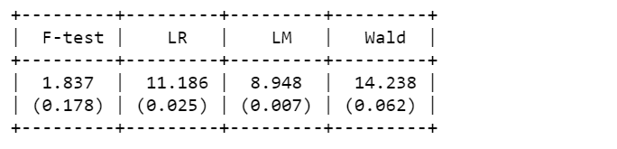
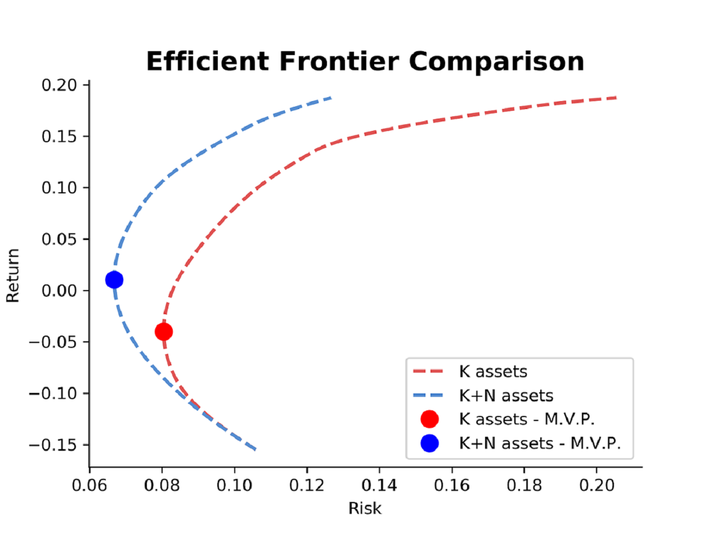

# Mean-Variance-Spanning-Test

> Methodology was built from **Kan and Zhou(2012)**, We all should be grateful for it.

**Introduction**
---
In Financial field, portfolio management is one of the boradly discussed issue.

Here are two main function
1. SpanningTest(self, benchmark_assets, test_assets)

2  EfficientFrontierComparison(self, portfolio1, portfolio2, p1_name, p2_name)

Spannging test can help us specific whether the assets about to add in our portfolio improve performance of our original portfolio.

Comparing the efficient frontier of original portfolio and added new assets portfolio show more intuitive result.


**Quick Guide**
---
1. Import class
```python
from SpanningTest import Investment

working = Investment()
```

2. Load the data of original portfolio and assets prepared to add

```
import pandas as pd

original_assets = pd.read_csv('original_assets.csv', index_col='Date', parse_dates=['Date'])
new_assets = pd.read_csv('new_assets.csv', index_col='Date', parse_dates=['Date'])
```
glimpse data
```python
original_assets.head()
```


```python
new_assets.head()
```


3. Do spanning test
```
working.SpanningTest(df1, df2)
```


4. Compare efficient frontier by plotting
```
working.EfficientFrontierComparison(df1, df2, 'K', 'N+K')
```

